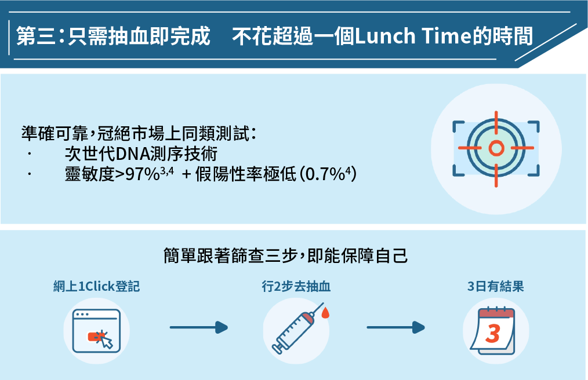

---
languages:
- zh-CN
cover:
- "../images/edmbanner-simplified.jpg"
date: 2022-08-01T00:00:00+08:00
title: "【筛查2重赏】限时钜惠活动　预约早期鼻咽癌筛查为健康添保障"
detail: 新一期的消费券将于8月7日开始陆续发放，想成为「精明」的消费者，当然是要把握优惠，投资于自己的健康！
type: ''
pdf: ''
href: ''
slug: take2-rewards

---

**立即预约：**[**https://bit.ly/3PsW2O8**](https://bit.ly/3PsW2O8 "https://bit.ly/3PsW2O8")

 

新一期的消费券将于8月7日开始陆续发放，想成为「精明」的消费者，当然是要把握优惠，投资于自己的健康！

 

**限时２重赏　可享优惠合共超过$800**

由即日起至2022年08月31日，在得易健康服务平台购买Take2 Prophecy™ 早期鼻咽癌筛查（单项测试），并在2022年9月5日或以前完成抽血程序，立即送您Samsung C&T ITFIT IPX7 防水蓝牙喇叭乙个（价值港币$498）。

 

在预约时，输入优惠码「NEW330」，更可享额外折扣$330 （原价：$2,200）。名额有限，把握机会，尽享优惠合共超过$800！

**立即预约：**[**https://bit.ly/3PsW2O8**](https://bit.ly/3PsW2O8 "https://bit.ly/3PsW2O8")

 

**以下三大原因让你了解进行早期鼻咽癌筛查的重要性，投资在健康上绝对是「物超所值」！**

 

 

 

愈早发现，治愈的可能性亦愈高，早期患者的存活率可高于百分之九十²。

**立即預約：**[**https://bit.ly/3PsW2O8**](https://bit.ly/3PsW2O8 "https://bit.ly/3PsW2O8")

 

优惠受条款及细则约束。礼品款式或颜色将随机送出，数量有限，先到先得，送完即止。

得易健康服务平台可支持下单当天两个工作天后的预约，唯所有预约需视乎服务供应者的实际供应情况而定。

1 _Hong Kong Cancer Registry_. Hong Kong Hospital Authority, www3.ha.org.hk/cancereg/. Accessed 23 May 2021.

2 _Overview of Hong Kong Cancer Statistics of 2019_. Hong Kong Cancer Registry. Hong Kong Hospital Authority, October 2021

3 Chan, K. C. Allen, et al. “Analysis of Plasma Epstein–Barr Virus DNA to Screen for Nasopharyngeal Cancer.” _New England Journal of Medicine_, vol. 377, no. 6, 2017, pp. 513–22.

4 Lam, W. K. Jacky, et al. “Sequencing-Based Counting and Size Profiling of Plasma Epstein–Barr Virus DNA Enhance Population Screening of Nasopharyngeal Carcinoma.” _Proceedings of the National_ _Academy of Sciences_, vol. 115, no. 22, 2018, pp. E5115–24.