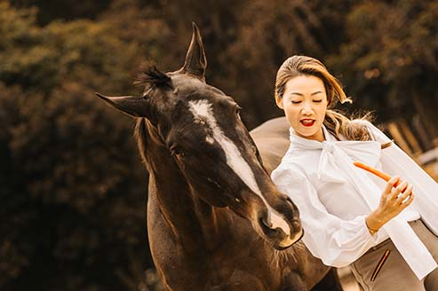

香港運動員持續在國際舞台發光發熱，他們堅毅不屈的鬥志和追求卓越的決心，絕對值得所有人的掌聲。Take2 Health作為香港的初創企業，同樣力瑧完美，一直致力守護大眾健康，不斷研發創新醫療科技。是次拍攝項目我們很榮幸邀請到四位本地運動菁英和Take2 Health一起預早準「鼻」，迎接挑戰。現在讓我們立即解構這次拍攝的細節吧！

**賽場爭勝要及早準備 掌控你的健康也如是**

Take2 Health和製作團隊為了能細緻地呈現香港運動員的特質，所以於構思階段時，向四位運動員在訓練、心路歷程和日常生活等方面皆作出全面了解，並展開了無數的熱烈討論。我們看過四位運動員在鎂光燈下挑戰自己、面對困難的故事，均發現他們通向成功的其中一個關鍵，就是預先的準備；和我們對於提防鼻咽癌、管理自己健康的信念不謀而合，最後鎖定是次拍攝的主題——「及早準備，掌握黃金時機」！

**維持良好狀態 從預早和身體溝通開始**

每一個動作早已完成過萬次，每一個細節也曾在腦海中預先上演，才造就出最好的表現。要在運動場上發揮出應有水準，比賽前的反覆練習當然是不可或缺。除此之外，運動員更要時刻掌控自己的身體狀況，即使極細微如肌肉的變化也不能錯過，才能制訂針對性的訓練和治療，達致最完美的效果；預早和身體溝通，認清自己的狀態，才能以更好的方式應對變數。越早準備，自然勝算越高。

你，同樣地，要及早準備！我們要有健康體魄，不單日常需要保持良好的生活習慣，也應定期了解自己的身體狀況，進行篩查，管理潛在的健康風險。我們在自覺很健康時，往往會習慣埋首於忙碌的生活及工作之中，當身體發出警號時，也甚少會聯想到自己患上疾病，未有正視。可是一旦疾病突然打亂你的生活時，你又是否已準備好面對變數？

任何人都一樣，愈早準備，就能愈早部署，從容面對突如其來的挑戰。所以我們攜手和四位運動員帶來是次拍攝項目，讓大家認識到「預早知，越早醫」的道理，以精準科學守護各位健康。

**揭開四位運動員主角的神秘面紗 認真製作．幕後花絮全公開**

_第一組主角：石仔和Kelvin_

石偉雄（石仔），香港體操運動員，主項為跳馬。他於2010年初次代表香港出戰亞運跳馬項目，並於兩年後首次取得奧運入場券，成為首位奧運體操香港代表。

石偉雄（石仔），香港體操運動員，主項為跳馬。他於2010年初次代表香港出戰亞運跳馬項目，並於兩年後首次取得奧運入場券，成為首位奧運體操香港代表。石偉雄（石仔），香港體操運動員，主項為跳馬。他於2010年初次代表香港出戰亞運跳馬項目，並於兩年後首次取得奧運入場券，成為首位奧運體操香港代表。

吳翹充（Kelvin），香港體操運動員，主項為吊環。在其體操生涯中，他不僅贏過多個國際獎項，更成功創出兩個以他名字命名的新吊環動作。吳翹充（Kelvin），香港體操運動員，主項為吊環。在其體操生涯中，他不僅贏過多個國際獎項，更成功創出兩個以他名字命名的新吊環動作。吳翹充（Kelvin），香港體操運動員，主項為吊環。在其體操生涯中，他不僅贏過多個國際獎項，更成功創出兩個以他名字命名的新吊環動作。

吳翹充（Kelvin），香港體操運動員，主項為吊環。在其體操生涯中，他不僅贏過多個國際獎項，更成功創出兩個以他名字命名的新吊環動作。

為了讓石仔和Kelvin拍攝時能更容易適應和進入狀態，製作團隊事先做了一連串的準備功夫，包括仔細地蒐集資料，亦從面談中了解石仔和Kelvin的日常生活習慣和日程。得知香港體操代表隊現時於順利邨體育館集訓，其訓練場地設有各項專業的體操訓練設施，包括吊環、跳馬高低槓、鞍馬、平衡木等器材，因而我們立即決定借用體育館作拍攝場地，除了期望為石仔和Kelvin消除緊張的心情，亦確保運動員可於安全的環境下完成動作拍攝，避免因拍攝的壓力而不慎受傷。

（製作團隊認真構思每個鏡頭）

此外，為使畫面更迫真和更有質感，石仔和Kelvin絕不馬虎，拍攝時全神貫注地演繹他們的比賽動作，起跳、轉身，都能感受到他們的認真、專業和扎實的功力，彷彿置身奧運比賽之中。為了將動作淋漓盡致地呈現，他們更反覆做出動作，讓攝影師能採用不同角度拍攝，盡可能捕捉細節，構造最完美的畫面。

（石仔和Kelvin認真演繹日常訓練動作）

（為求完美，石仔反覆做出他的招牌動作）

_第三位主角：Chris_

張立興 (Chris)，香港自由潛水紀錄保持者，也是香港自由潛水協會的會長。早前於地區賽事中，他在同時打破3項香港自由潛水記錄下（靜態閉氣、動態閉氣帶雙蹼及動態閉氣不帶蛙鞋）取得男子組全場總冠軍。

自由潛水於香港現時仍非一項很普及的運動，因此製作團隊於拍攝前，也請教了Chris有關他的日常訓練日程。要不帶任何裝備，徒手潛入深海，一個充滿變數的海底世界，Chris坦言唯一可以控制的就是他的身體和狀態。所以他會透過每日的恆常訓練，來穩定自己的身體狀態，這也成了他的拍攝主要內容，在影片中可以見到不少他練習瑜伽及冥想的畫面。

Chris解釋道，練習瑜珈可使他的身軀比一般人柔軟，有利提升他在水中的流暢度；而通過掌握腹式呼吸的技術，及冥想中專注於身體的正念技巧，可以有助他平靜心神，將意識帶到身體的不同部位並專注於放鬆身心。這些都能讓自由潛水員更有效率的運用肌肉，減少體力的消耗，進而降低耗氧量。

（拍攝內容圍繞Chris的日常瑜伽及冥想訓練）

當然，提及自由潛水，怎麼會沒有戶外拍攝呢？為了令拍攝更順利，Chris於整個拍攝準備階段一直提供幫助。例如他比較熟識天氣和海上的變化，所以也分享了很多有關天氣預測的知識，讓製作團隊於準備安排做得更好，最終選擇了合適的拍攝地點。

（Chris就像製作團隊的「天文台」，提供很多實用的天氣知識）

P.S. 我們就告訴大家一個可特別留意的彩蛋吧！這次的拍攝，很高興可以邀請到特別嘉賓，就是Chris的兩位寶貝女兒。Chris除了是自由潛水的冠軍級人馬，他同時是一個慈父。在拍攝現場，兩位女兒熟練的做出一字馬等瑜伽動作，加上他們一家的真摰對話和互動，可見他們的關係非常融洽，也令拍攝的氣氛變得更愉快。

（Chris和兩位寶貝女兒的互動，令現場氣氛十分歡樂）

_第四位主角：Sherie_

江碧蕙 (Sherie)，全球首位華人女騎師，於16歲時開始於騎術學校受訓，並在一年後出道。19歲時即贏得頭馬，往後在5 年的賽馬生涯中，共贏得 11 次頭馬。

（製作團隊嘗試拍攝馬匹的「動作畫面」）

相信製作團隊中沒有人比Sherie 更熟悉和了解馬匹的一舉一動了。為了切合Sherie的拍攝內容，製作團隊設定了一些和馬匹互動的畫面，因此Sherie需要做出有一定危險性的動作。要拍攝到精彩畫面，這個時候我們和製作團隊都需要Sherie的豐富經驗，在短時間內透過接觸馬匹，來了解馬匹當天的心情和狀態。全靠Sherie事前和馬匹溝通，建立起信任與默契，我們的拍攝才得以順利進行。

